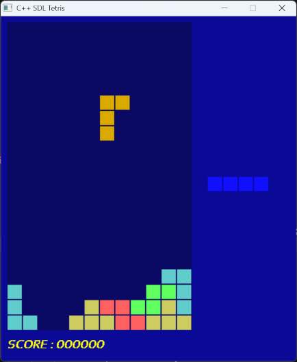

# C++ SDL Tetris

A classic Tetris game written in C++ using SDL2. This project features state-based game flow (Title Screen, Gameplay, High Scores, Game Over), custom audio/image resource embedding, and smooth tetromino rotation and movement algorithms.



## Features

- **Classic Tetris Mechanics**: Standard tetromino shapes, rotation collision checks, line-clearing logic, and progressive speed.
- **Embedded Resources**: Audio (MP3) and graphical assets are converted and bundled directly into the source build.
- **Multiple Screens Modes**:
  - **StandByMode**: Main title/start screen.
  - **PlayMode**: Core Tetris gameplay loop and scoring.
  - **HighScoresMode**: Scoreboard view.
  - **GameOverMode**: End-of-game screen.
- **Cross-Platform Build System**: Configured using CMake.

## Prerequisites

Before building the project, ensure you have the following installed on your system:

- **C++ Compiler**: Supporting C++17 or later (e.g., GCC, Clang, or MSVC).
- **CMake**: Version 3.10 or higher.
- **SDL2 Development Libraries**:
  - `SDL2`
  - `SDL2_image`
  - `SDL2_mixer`
  - `SDL2_ttf`
- **Python 3** (Optional): Needed if regenerating header resources from raw assets.

### Installing Dependencies

- **Ubuntu / Debian**:
  ```bash
  sudo apt-get update
  sudo apt-get install build-essential cmake libsdl2-dev libsdl2-image-dev libsdl2-mixer-dev libsdl2-ttf-dev

- **macOS (via Homebrew)**:
  ```bash
  # Update Homebrew
  brew update

  # Install CMake and required SDL2 libraries
  brew install cmake sdl2 sdl2_image sdl2_mixer sdl2_ttf

- **For MinGW 64-bit (MINGW64)**:
  ```bash  
  pacman -S --needed \
    mingw-w64-x86_64-toolchain \
    mingw-w64-x86_64-cmake \
    mingw-w64-x86_64-SDL2 \
    mingw-w64-x86_64-SDL2_image \
    mingw-w64-x86_64-SDL2_mixer \
    mingw-w64-x86_64-SDL2_ttf

## Building the Project

1. **Clone the repository**:
   ```bash
   git clone [https://github.com/nguray/VcCppSDLTetris.git](https://github.com/nguray/VcCppSDLTetris.git)
   cd VcCppSDLTetris

2. **Generate build files using CMake**:
   ```bash
   cmake -B build -DCMAKE_BUILD_TYPE=Release

3. **Compile the executable**:
   ```bash
   cmake --build build --config Release

4. **Run the game**:
   - **macOS / Linux**:
     ```bash
     ./build/SDLTetris
     ```
   - **Windows (MSYS2 / MinGW)**:
     ```bash
     ./build/SDLTetris.exe
     ```


## Controls

| Key | Action |
| :--- | :--- |
| **Left Arrow** | Move Tetromino Left |
| **Right Arrow** | Move Tetromino Right |
| **Up Arrow** | Rotate Tetromino |
| **Down Arrow** | Soft Drop (Move Down Faster) |
| **Spacebar** | Hard Drop |
| **Enter / Return** | Confirm Selection / Start Game |
| **Escape** | Pause / Return to Menu / Exit |

## Project Structure
```text
VcCppSDLTetris/
├── CMakeLists.txt           # Build configuration and library link definitions
├── SDLTetris.cpp            # Main entry point initializing engine and window
├── Game.cpp / .h            # Core engine class handling main game loop & events
├── IGameMode.h              # Abstract state interface for game screens
├── PlayMode.cpp / .h        # Play state: grid, block movement, line clear logic
├── StandByMode.cpp / .h     # Title and start menu screen state
├── GameOverMode.cpp / .h    # End-of-game overlay state
├── HighScoresMode.cpp / .h  # Score tracking and leaderboard view state
├── Tetromino.cpp / .h       # Piece definitions, rotation matrices, matrix logic
├── TetrisConst.h            # Global constants (dimensions, colors, speeds)
├── resources.cpp / .h       # Compiled C++ array representations of audio/fonts
└── res_to_uint32_header.py  # Python utility script for embedding raw assets
```

## Architecture Overview
```text
+-------------------+
               |     SDLTetris     |  (Entry Point)
               +---------+---------+
                         |
                         v
               +-------------------+
               |       Game        |  (Main Game Engine Loop)
               +---------+---------+
                         |
                         v
               +-------------------+
               |    IGameMode      |  (State Interface)
               +----+----+----+----+
                    |    |    |
        +-----------+    |    +-----------+
        |                v                |
+-------+-------+ +------+------+ +-------+-------+
| StandByMode   | |  PlayMode   | | GameOverMode  | ...
+---------------+ +------+------+ +---------------+
                         |
                         v
                +-----------------+
                |   Tetromino     |
                +-----------------+
```

